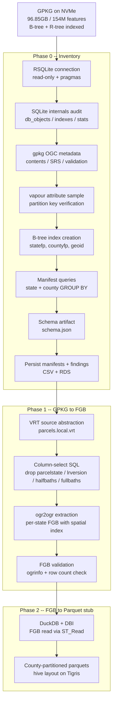

# US Parcels: Phase 0 + Phase 1 Implementation Plan

## Current State

- **GPKG**: 93.66 GB (96.85 GB after index), 154,891,095 features, single layer `lr_parcel_us`, EPSG:4326, WAL mode active
- **Schema**: 51 fields + geometry; partition keys `statefp` (2-char) / `countyfp` (3-char); `geoid` pre-concatenated
- **Indexes**: R-tree spatial index + B-tree `idx_parcel_state_county` on `(statefp, countyfp, geoid)` (created 2026-04-09, 5.5 min)
- **Confirmed drops**: `parcelstate` (0%), `lrversion` (uniform "2026.1"), `halfbaths` (0%), `fullbaths` (0%)
- **GPKG location**: `C:/GEODATA/LR_PARCEL_NATIONWIDE_FILE_US_2026_Q1.gpkg` (Windows NVMe), WSL: `/mnt/c/GEODATA/...`
- **Environment**: pixi on WSL with GDAL 3.12.3 + Arrow/Parquet driver + DuckDB 1.5.1 CLI
- **Tigris bucket**: `noclocks-parcels` created, existing buckets: `noclocks-parcels-parquet`, `noclocks-parcels-source`

### Completed work (2026-04-09)

- B-tree index created on GPKG (5.5 min on NVMe)
- County manifest (3,229 rows) and state rollup (55 rows) generated and saved to `data/meta/`
- Attribute profiling via DuckDB on GA parquet: identified 4 safe nationwide drops
- Geometry complexity profiling: median 8 vertices, p99 131, max 128K, 311 invalid (0.007%)
- GA FGB extracted: 4,754,448 features, 2.9 GB, 4 min
- NC FGB extracted: 5,756,891 features, 4.1 GB, 6 min
- Reusable extraction script: `scripts/gpkg_fgb_extraction.sh`

## Architecture Overview



## Phase 0 -- Inventory and Metadata

The core investigatory phase. All functions operate via RSQLite/DBI in read-only mode (except index creation). Produces manifests that drive all downstream work. Split across `parcels_connect.R`, `parcels_audit.R`, `parcels_sample.R`, `parcels_manifest.R`, and `parcels_schema.R`.

### 0a. GPKG Connection + Pragma Tuning

Create a reusable connection helper in `R/parcels_connect.R` that:
- Opens the GPKG with `SQLITE_RO` flag
- Sets session pragmas: `cache_size = -4000000` (4GB), `temp_store = MEMORY`
- Omits `mmap_size` (no-op via WSL 9P to NTFS)
- Returns the connection with an `on.exit(dbDisconnect)` pattern for callers

### 0b. SQLite Internals Audit

Function: `parcels_audit_db(gpkg_path)` returning a list with:
- `db_objects` from `sqlite_master`
- B-tree indexes on `lr_parcel_us` (now includes `idx_parcel_state_county`)
- R-tree virtual tables (4)
- DB file stats: `page_count`, `page_size`, `db_size_gb`, `free_pages`
- Scalar pragmas: `journal_mode`, `wal_autocheckpoint`

### 0c. GPKG OGC Metadata

Function: `parcels_audit_gpkg(gpkg_path)` using `gpkg` package:
- `gpkg::gpkg_contents()` -- layer-level metadata
- `gpkg::gpkg_spatial_ref_sys()` -- CRS definitions
- `gpkg::gpkg_ogr_contents()` -- cached feature count (154,891,095)
- `gpkg::gpkg_validate()` -- OGC spec compliance
- `DBI::dbReadTable("gpkg_geometry_columns")` -- geom column metadata (since `gpkg_geometry_columns()` is not exported)
- `gdalraster::ogrinfo()` -- authoritative schema + CRS

### 0d. Attribute Sampling

Function: `parcels_sample_attrs(gpkg_path, n = 1000)` using `vapour::vapour_read_attributes()`:
- Verify `statefp` is zero-padded 2-char, `countyfp` is zero-padded 3-char
- Verify `geoid` = `statefp || countyfp`
- Confirm `parcelstate` NULL rate
- Confirm `lrversion` uniformity ("2026.1")

### 0e. B-tree Index Creation (one-time, RW) -- DONE

Function: `parcels_create_index(gpkg_path)`:
- Opens RW connection
- Creates `idx_parcel_state_county ON lr_parcel_us (statefp, countyfp, geoid)`
- Verifies via `EXPLAIN QUERY PLAN` that the GROUP BY uses `COVERING INDEX`
- Completed: 5.5 min on NVMe, ANALYZE run, query planner confirmed

### 0f. Manifest Generation -- DONE

Function: `parcels_build_manifest(gpkg_path)` returning two data frames:
- **County manifest** (`manifest_state_county.csv`): `state_fips`, `county_fips`, `geoid_county`, `feature_count`, `null_geom_count`, `min_lrid`, `max_lrid`
- **State rollup** (`manifest_state_rollup.csv`): `state_fips`, `county_count`, `feature_count`, `null_geom_count`, `pct_of_total`, `cumulative_pct`, `large_state` flag, `est_parquet_mb`
- Sanity checks passed: total = 154,891,095, all geoids valid, all fips codes properly padded

### 0g. Field-Level Statistics -- DONE (via DuckDB on GA parquet)

Profiled from existing GA parquet in 4 seconds:
- Identified 4 safe nationwide drops: `parcelstate`, `lrversion`, `halfbaths`, `fullbaths`
- Geometry: median 8 vertices, p99 131, max 128K, 311 invalid (0.007%)
- No blanket simplification warranted

### 0h. Schema Artifact

Function: `parcels_schema(gpkg_path)` producing `data/meta/schema.json`:
- Canonical field list with OGR types
- Drop list with reasons
- Partition key designation (`statefp`, `countyfp`)
- Version/provenance metadata

### 0i. Persist All Findings -- PARTIALLY DONE

Written to `data/meta/`:
- `manifest_state_county.csv` -- DONE
- `manifest_state_rollup.csv` -- DONE
- `field_stats.csv` -- pending (formal artifact)
- `schema.json` -- pending
- `findings.rds` -- pending

---

## Phase 1 -- GPKG to FlatGeoBuf Extraction

Per-state extraction from the monolithic GPKG into individual FGB files with cleaned schema and Hilbert-packed spatial index.

### 1a. VRT Configuration -- DONE

[data/sources/parcels.vrt](data/sources/parcels.vrt) updated with:
- `parcels-local-wsl` pointing to `/mnt/c/GEODATA/...` (NVMe)
- `parcels-local-windows` pointing to `C:/GEODATA/...`
- `parcels-cloud` pointing to `/vsis3/noclocks-parcels-source/...`
- Canonical `parcels` alias → `parcels-local-wsl`

### 1b. Extraction Function -- DONE (as shell script)

Script: `scripts/gpkg_fgb_extraction.sh` with:
- `-f FlatGeoBuf`, `-lco SPATIAL_INDEX=YES` (Hilbert R-tree)
- `-sql` for explicit column selection (drops 4 columns)
- `-spat` optional (B-tree index on statefp makes WHERE sufficient alone)
- Environment: `OGR_SQLITE_PRAGMA`, `OGR_GPKG_NUM_THREADS=ALL_CPUS`, `GDAL_CACHEMAX=2048`
- Output: `data/output/flatgeobuf/state={XX}/parcels.fgb`

### 1c. Validation -- DONE (manual, 2 states)

- GA: 4,754,448 features, 2.9 GB, 47 columns, schema verified
- NC: 5,756,891 features, 4.1 GB, feature count matches manifest exactly

### 1d. Column Selection SQL

Selects all fields except `parcelstate`, `lrversion`, `halfbaths`, `fullbaths`:

```sql
SELECT
  lrid, parcelid, parcelid2, geoid, statefp, countyfp,
  taxacctnum, taxyear, usecode, usedesc, zoningcode, zoningdesc,
  numbldgs, numunits, yearbuilt, numfloors, bldgsqft,
  bedrooms,
  imprvalue, landvalue, agvalue, totalvalue, assdacres,
  saleamt, saledate,
  ownername, owneraddr, ownercity, ownerstate, ownerzip,
  parceladdr, parcelcity, parcelzip,
  legaldesc, township, section, qtrsection, range,
  plssdesc, book, page, block, lot, updated,
  centroidx, centroidy, surfpointx, surfpointy,
  geom
FROM lr_parcel_us
WHERE statefp = '{state_fips}'
```

---

## R File Organization

The naming convention follows the `{prefix}_{concern}.R` module pattern established across your packages (e.g. `geo_config.R`, `db_connect.R`, `utils_checks.R`). Functions within each file share the file's prefix as their name prefix.

### Phase 0 + Phase 1 Files (populate now)

**`parcels_*` -- parcel-specific pipeline functions:**
- **[R/parcels_connect.R](R/parcels_connect.R)** -- GPKG connection helpers: `parcels_connect()` (RO + pragmas), `parcels_connect_rw()`, `parcels_disconnect()`
- **[R/parcels_audit.R](R/parcels_audit.R)** -- Investigatory/introspection: `parcels_audit_db()` (sqlite_master, indexes, file stats, pragmas), `parcels_audit_gpkg()` (OGC metadata via gpkg pkg), `parcels_audit_schema()` (ogrinfo field types + CRS)
- **[R/parcels_sample.R](R/parcels_sample.R)** -- Attribute sampling: `parcels_sample_attrs()` (vapour-based partition key + field verification)
- **[R/parcels_manifest.R](R/parcels_manifest.R)** -- Manifest generation: `parcels_create_index()`, `parcels_build_manifest()` (county + state rollup), `parcels_field_stats()`
- **[R/parcels_schema.R](R/parcels_schema.R)** -- Schema artifact: `parcels_schema()` (canonical field list, drop list, partition keys -> schema.json)
- **[R/parcels_extract.R](R/parcels_extract.R)** -- Phase 1 FGB extraction: `parcels_extract_fgb()` (ogr2ogr with column-select SQL + spatial pre-filter from manifest)
- **[R/parcels_validate.R](R/parcels_validate.R)** -- Post-extraction validation: `parcels_validate_fgb()` (schema check, feature count vs manifest)

**`gdal_*` -- generic GDAL utility wrappers (not parcel-specific):**
- **[R/gdal_config.R](R/gdal_config.R)** -- GDAL environment setup: `gdal_sqlite_pragmas()`, `gdal_set_env()`, `gdal_check_driver()`
- **[R/gdal_ogr.R](R/gdal_ogr.R)** -- Generic ogr2ogr wrapper: `gdal_ogr2ogr()` (builds + executes ogr2ogr via system2/processx), `gdal_ogrinfo()`

**`utils_*` -- cross-cutting utilities:**
- **[R/utils_checks.R](R/utils_checks.R)** -- Validation predicates: `check_file_exists()`, `check_gpkg()`, `check_fips()`, `check_manifest()`
- **[R/utils_fips.R](R/utils_fips.R)** -- FIPS reference data: `fips_states()`, `fips_state_name()`, `fips_state_bbox()` (lookups from bundled reference)

**Bookend files:**
- **[R/aaa.R](R/aaa.R)** -- Shared internal constants, default paths, column lists (e.g. `PARCELS_DROP_COLS`, `PARCELS_LAYER`, `PARCELS_SELECT_SQL`)
- **[R/zzz.R](R/zzz.R)** -- Initialization (source env setup, config loading if applicable)

### Deferred Files (remain empty stubs)

These correspond to later phases and other data sources. They keep their current names as placeholders:
- `gdal_gdalg.R`, `gdal_pipeline.R`, `gdal_vrt.R`, `gdal_vsi.R` -- GDALG specs, vector pipelines, VRT gen, VSI remote access
- `data_tiger.R`, `data_fema.R`, `data_meta.R` -- TIGER/FEMA/metadata source integrations
- `utils_cache.R`, `utils_remote.R` -- Caching, Tigris/S3 upload utilities

### Renamed / Removed Stubs

The current stubs that get replaced by the new naming:
- `data_parcels.R` -> split into `parcels_connect.R`, `parcels_audit.R`, `parcels_sample.R`, `parcels_manifest.R`, `parcels_schema.R`
- `data_fips.R` -> `utils_fips.R` (cross-cutting reference, not a data source)

### Function Naming Convention

All functions follow `{module}_{verb/noun}()`:
- `parcels_connect()`, `parcels_audit_db()`, `parcels_build_manifest()`, `parcels_extract_fgb()`
- `gdal_ogr2ogr()`, `gdal_sqlite_pragmas()`, `gdal_check_driver()`
- `check_gpkg()`, `check_fips()`, `fips_states()`

Internal helpers (not exported) use a dot prefix: `.parcels_default_path()`, `.parcels_select_sql()`.

---

## Key Decisions from the Architecture Discussion

- **FGB as intermediate**: 40-60% smaller than GPKG, Hilbert spatial index, universally readable, repeatable extraction target -- avoids re-reading 93GB GPKG for every downstream iteration
- **DuckDB + DBI only for Phase 2**: no arrow/sfarrow/geoarrow/dbplyr/duckplyr in pipeline code; those are for interactive analysis only
- **ogr2ogr pragmas**: drop `mmap_size` (no-op via 9P); keep `cache_size`, `temp_store`, `journal_mode=WAL`
- **ZSTD compression**: level 3 during development iteration, level 15 for final Tigris distribution artifacts
- **ROW_GROUP_SIZE**: 65536 default for county parquets; dynamic sizing from manifest for Phase 2 (`max(16384, floor(feature_count / 10))`)
- **Schema cleanup at FGB stage**: all downstream formats (Parquet) inherit the cleaned schema
- **`statefp` retained in data**: self-describing files even though it is the partition key
- **FGB stays local**: `SPATIAL_INDEX=YES` requires seekable output, incompatible with `/vsis3/`; upload to Tigris separately
- **Index creation**: worthwhile for manifest and ad-hoc queries despite not helping ogr2ogr
- **No bbox needed for extraction**: B-tree index on `statefp` makes `WHERE` clause efficient; `-spat` is optional optimization
- **Batch extraction**: ~4-6 min per state on NVMe, ~4-5 hours for all 55 state/territory codes

---

## Execution Order

1. ~~Phase 0: index + manifest + profiling~~ -- DONE
2. ~~Phase 1: GA + NC FGB extraction~~ -- DONE
3. Scaffold R file structure to match convention
4. Implement R functions wrapping the validated script patterns
5. Batch FGB extraction for remaining 53 states
6. Upload FGBs to Tigris (`noclocks-parcels` bucket)
7. Phase 2: FGB to county-partitioned Parquet via DuckDB (separate follow-up)
