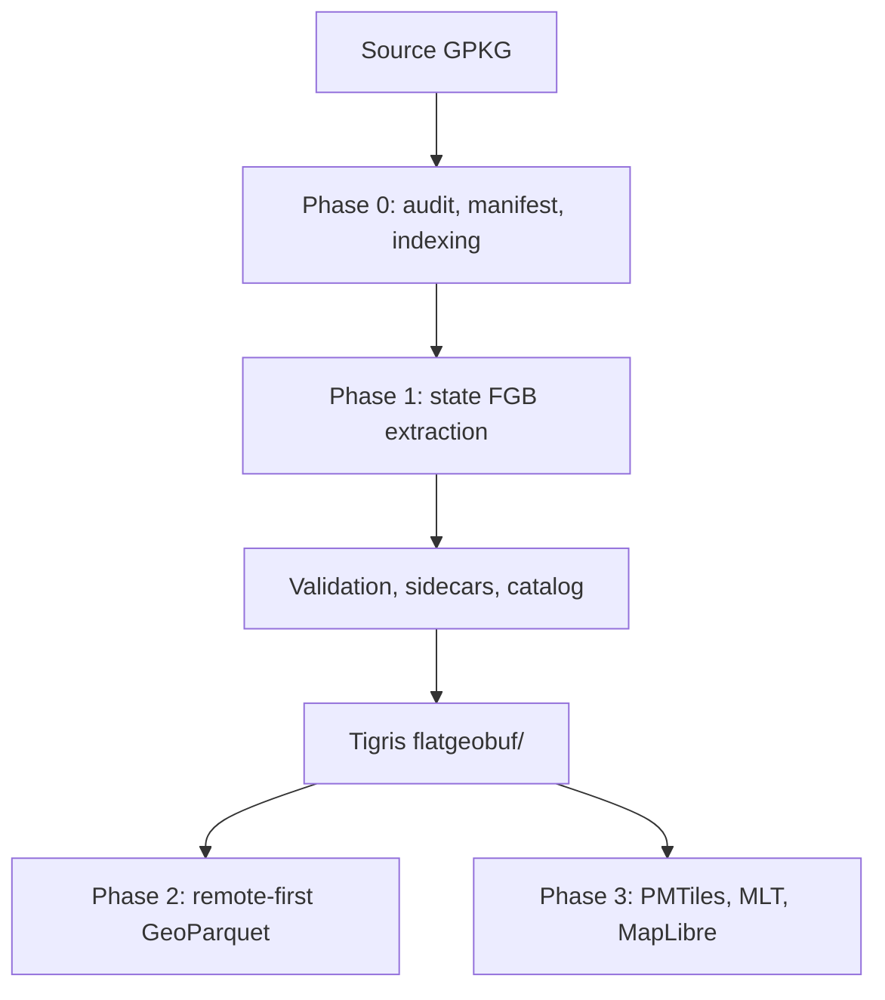

# Parcels Pipeline

## Purpose

This document describes the current established parcel workflow as a
specification. It captures the behavior that is now considered intentional and
stable enough to serve as the primary implementation reference.

## Current Pipeline



## Phase 0: Source Preparation

### Inputs

- upstream GeoPackage source documented in [../sources/parcels.md](../sources/parcels.md)

### Established preparation steps

- inspect the GeoPackage schema and internals
- enable WAL mode on the working file
- add B-tree index `idx_parcel_state_county` on:
  - `statefp`
  - `countyfp`
  - `geoid`
- generate:
  - `data/meta/manifest_state_county.csv`
  - `data/meta/manifest_state_rollup.csv`
  - `data/meta/state_bboxes.csv`

### Outputs

- indexed and queryable working GeoPackage
- manifest and reference artifacts under `data/meta/`

## Phase 1: State FlatGeoBuf Extraction

### Goal

Extract one state or territory at a time from the monolithic GeoPackage into a
validated, remotely publishable FlatGeoBuf artifact with a cleaned schema.

### Current implementation artifacts

- [scripts/pwsh/Extract-StateFGB.ps1](../../scripts/pwsh/Extract-StateFGB.ps1)
- [scripts/pwsh/Test-StateFGB.ps1](../../scripts/pwsh/Test-StateFGB.ps1)

### Extraction contract

For each state:

1. look up the state bounding box from `data/meta/state_bboxes.csv`
2. execute `ogr2ogr` through `pixi run`
3. filter on:
   - `WHERE statefp = 'XX'`
   - state bounding box via `-spat`
4. write a single FGB:
   - `statefp=XX/parcels.fgb`
5. build a packed Hilbert spatial index:
   - `-lco SPATIAL_INDEX=YES`
6. embed lightweight human-readable header metadata:
   - `-lco TITLE=...`
   - `-lco DESCRIPTION=...`

### Why both `WHERE` and `-spat` are used

This is intentional. The source contains a small number of empty / degenerate
geometries. The bounding-box filter leverages the spatial index and naturally
excludes those features from the extracted FGB. The result is that a small
negative difference between manifest count and extracted feature count is
acceptable during validation.

### Current FGB schema contract

- 47 retained attribute fields plus geometry
- dropped fields:
  - `parcelstate`
  - `lrversion`
  - `halfbaths`
  - `fullbaths`
- `lrid` is not materialized into the FGB output schema

See [../specs/fgb-metadata.md](../specs/fgb-metadata.md) for the associated
metadata contract.

## Validation, Sidecars, and Catalog

### Validation checks

Each extracted FGB is validated against:

- expected feature counts from `manifest_state_rollup.csv`
- expected schema width and dropped-field behavior
- geometry type and CRS
- header metadata presence or absence

### Validation outputs

Per state:

- `parcels.fgb`
- `parcels.fgb.json`

Collection-level:

- `data/meta/fgb_validation_report.csv`
- `data/output/flatgeobuf/catalog.json`

### Current metadata distinction

There are now two classes of state FGBs:

- **legacy FGBs**
  - extracted before header metadata handling was corrected
  - sidecars exist
  - `has_header_metadata = false`
- **current FGBs**
  - extracted with `-lco TITLE` and `-lco DESCRIPTION`
  - sidecars exist
  - `has_header_metadata = true`

This distinction is expected and explicitly documented; it is not currently a
validation failure.

## Tigris Publication Layout

The current publication layout is:

```text
flatgeobuf/
  catalog.json
  statefp=11/
    parcels.fgb
    parcels.fgb.json
  statefp=13/
    parcels.fgb
    parcels.fgb.json
  ...
```

The bucket is intentionally public for reads.

### Read paths

- `/vsicurl/https://noclocks-parcels.t3.storage.dev/...`
- `/vsis3/noclocks-parcels/...`

### Write path

- `/vsis3/` only

## Remote Access Semantics

### `/vsicurl/`

- generic HTTPS range requests
- public-read path
- appropriate for external consumers and tools without credentials

### `/vsis3/`

- S3 API path
- credentialed access
- required for writes
- also valid for reads

### Format behavior over range requests

| Format | Read pattern |
|---|---|
| FGB | header + Hilbert index + targeted feature reads |
| GeoParquet | footer first, then targeted row-group reads |
| PMTiles | direct tile offset reads |

## Local-to-Remote Transition

The GeoPackage remains local because FlatGeoBuf cannot be written directly to a
non-seekable remote target.

Once the state FGBs are all uploaded to Tigris, the workflow transitions to a
remote-first model:

- read FGBs from Tigris
- produce downstream GeoParquet remotely
- stop depending on the local GPKG for normal downstream work

## Current Stable Artifacts

At the time of writing, the validated state set includes:

- `11` District of Columbia
- `13` Georgia
- `37` North Carolina
- `44` Rhode Island
- `48` Texas

These should be treated as the current contract-validation set for future
changes to extraction or validation behavior.
